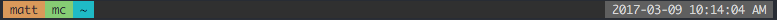
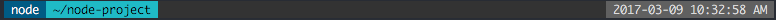

Some dotfiles
=============

This setup is mostly shell agnostic, supporting [fish](http://fishshell.com/), [bash](https://www.gnu.org/software/bash/) and [zsh](http://www.zsh.org/). I spend most of my time in fish, however.

Tour
====

### Applications
Included are configurations for some applications, such as:
- [Atom](https://atom.io/)
- [Emacs](https://www.gnu.org/software/emacs/)
- [Clojure](https://clojure.org/) - [Leiningen](https://leiningen.org/) and [Boot](http://boot-clj.com/)
- [ssh-agent](http://mah.everybody.org/docs/ssh)
- [tmux](https://tmux.github.io/)
- [Vim](https://vim.sourceforge.io/)

### Prompt
The prompt displays a bunch of fancy stuff in a status bar type setup, mildly inspired by [vim-lightline](https://github.com/itchyny/lightline.vim). I find this pleasant because it clearly delineates one command from the next, making scrolling through history more pleasant. Most of it is conditional based on the current machine or directory. All of this is custom with an emphasis on clarity, extensibility, and speed, even when working over slow links and network shares, when each file access is costly. Functionality is intentionally kept simple so that the above goals can be met.
- Error return code<br>
  
- Directory<br>
  
- Username (only displays within SSH)<br>
  
- Hostname (only displays within SSH)<br>
  
- Git repository and clean/dirty status<br>
  
- Ruby rbenv<br>
  
- Python virtualenv<br>
  
- Node project (not nvm -- pull request?)<br>
  
- Clojure project (leiningen or boot project)<br>
  
- Vagrant project<br>
  
- Background jobs<br>
  
- Tmux sessions<br>
  
- Date and time<br>
  

### Prompt Benchmarks
External commands and especially disk access has been minimized to provide the best performance possible. Benchmarks will vary wildly across different machines, environments, and directories. Here are examples taken from my machine from my `~` directory.

#### fish
```
> realtime 'for i in (seq 500); fish_prompt_status >/dev/null; end'

real	0m43.291s
```

#### bash
```
$ time bash -lc 'for i in {1..500}; do bash_prompt >/dev/null; done'

real	0m48.334s
user	0m18.988s
sys	0m18.067s
```

#### zsh
```
$ time zsh -lc 'for i in {1..500}; do bash_prompt >/dev/null; done'

real	0m54.731s
user	0m17.284s
sys	0m20.014s
```

Install
=======

### Clone the repository

```bash
git clone https://gitlab.com/mnewt/dotfiles.git
```

Examine the settings file, named `install.settings`:

```bash
# Settings for the `install` script
# This file tells install.sh what to ignore, link, copy, and create
# List files (and globs) separated by spaces
# The below options are in order of priority, so ignore overrides
# link_children, which overrides copy, which overrides link
# That is why it's OK to just specify '*' for link

# ignore these files (modifies include)
ignore='install* scripts Icon* *.md *.sh TODO*'

# create directory itself (not contents), then link the children of the directory
# NOTE: it will not delete the directory. If you want to replace the directory,
#				delete it first, then run `install`
link_children='config atom'

# just copy these files
copy=''

# list of files to link
link='*'

```


Run the installer.

    ./install

It creates symlinks for all dotfiles in your home directory. You can safely run
the installer multiple times to update.


## fish shell

To install and switch your shell to `fish` on OS X:

    # Optionally install GNU coreutils, fish, grc, and vimpager
    brew coreutils install fish python grc vimpager
    echo "/usr/local/bin/fish" | sudo tee -a /etc/shells
    chsh -s /usr/local/bin/fish

And then run fish

    fish -l
    fisher

Command reference for the `install` script:
-----------------------------------

```
install  ver 0.8 - 2017-02-24

Copies/links files and directories from the current dir to the user's home dir

USAGE: install [OPTIONS] [SOURCE-DIR] [DEST-DIR]
    SOURCE-DIR defaults to the current directory
    DEST-DIR defaults to the current user's home directory

OPTIONS:
  -f (--force)    : force overwrite of files or directories in DEST-DIR
                    (default is false)
  -t (--test)     : test mode - only display changes, don't make them
                    (default is false)
  -c (--config)   : specify a configuration file
                    (default configuration file is `install.settings`)
                      Example config file contents:
                        # Settings (can use globs)
                        # ignore these files (modifies include)
                        ignore='Icon* *.md *.sh *.txt scripts'
                        # create dir (not contents), then sym-link children (contents)
                        link_children='config'
                        # copy these files
                        copy=''
                        # sym-link these files
                        link='*'

  -h (--help)     : display this help and exit
  -V (--version)  : output version information and exit

  SOURCE-DIR      : directory containing dotfiles to be copied and/or linked
                    (default is current directory)
                      files should NOT have leading '.'
                      example: '.bashrc' should be named 'bashrc' in SOURCE-DIR

  DEST-DIR        : target directory where copies and links will be placed
                    (default is '~')
```

Notes on Applications
============

## Atom
Install atom, then run this to install packages

    apm install --packages-file packages.txt


To save the list of currently installed packages

    apm list --bare --installed --dev false > packages.txt
