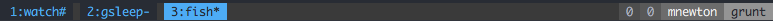

Some dotfiles
=============

This setup is mostly shell agnostic, supporting [fish](http://fishshell.com/), [bash](https://www.gnu.org/software/bash/) and [zsh](http://www.zsh.org/). I spend most of my time in fish, however.

NOTE: The master repository is on [GitLab](https://gitlab.com/mnewt/dotfiles)
but since most people use [GitHub](https://github.com/mnewt/dotfiles) it has been
cloned there. Feel free to create issues or pull requests on either (but I do
prefer GitLab).

Tour
====

### Applications & Utilities
Included are configurations for some programs, such as:
- [Atom](https://atom.io/)
- [Clojure](https://clojure.org/) - [Leiningen](https://leiningen.org/) and [Boot](http://boot-clj.com/)
- [Emacs](https://www.gnu.org/software/emacs/)
- [Git](https://git-scm.com/)
- [ssh-agent](http://mah.everybody.org/docs/ssh)
- [tmux](https://tmux.github.io/)
  
- [Vim](https://vim.sourceforge.io/) / [NeoVim](https://neovim.io/)

### Prompt
The prompt displays a bunch of fancy stuff in a status bar above the prompt. The status bar is mildly inspired by [vim-lightline](https://github.com/itchyny/lightline.vim). I find this pleasant because it clearly delineates one command from the next, making it easier to spot previous commands while scrolling through history. Most of the status modules are conditional based on the current machine or directory. None of them use any outside dependencies. I have tried to implement this with clarity, extensibility, and speed in mind. The prompt should always be fast--even when working over slow links and network shares, when each file access is costly. Functionality is intentionally kept simple (e.g. git status indicates only current branch and a loose interpretation of dirty status) so that the above goals can be met.
- Error return code<br>
  
- Directory<br>
  
- Username (only displays within SSH)<br>
  
- Hostname (only displays within SSH)<br>
  
- Git repository and clean/dirty status<br>
  
- Ruby rbenv<br>
  
- Python virtualenv<br>
  
- Node project (not nvm -- pull request?)<br>
  
- Clojure project (leiningen or boot project)<br>
  
- Vagrant project<br>
  
- Background jobs<br>
  
- Tmux sessions<br>
  
- Date and time<br>
  

### Prompt Benchmarks
External commands and especially disk accesses have been minimized to provide good performance. Benchmarks will vary wildly across different machines, environments, and directories. Here are examples taken from my machine from my dotfiles directory.

    > benchmark-prompt

     fish

    real	0m43.238s
    user	0m20.676s
    sys	0m13.999s

     bash

    real	0m54.019s
    user	0m20.819s
    sys	0m21.674s

     zsh

    real	0m50.815s
    user	0m18.460s
    sys	0m21.213s


Install
=======

### Clone the repository

    git clone https://gitlab.com/mnewt/dotfiles.git

### Script
There is an install script that can link and/or copy files between the cloned repo
directory and your $HOME directory.

Examine the settings file, named `install.settings`:

```bash
# Settings for the `install` script
# This file tells install.sh what to ignore, link, copy, and create
# List files (and globs) separated by spaces

# The below options are in order of priority, so ignore overrides
# link_children, which overrides copy, which overrides link
# That is why it's OK to just specify '*' for link

# Run before the `install` operations
before () {
  :
}

# ignore these files (modifies include)
ignore='install* images scripts Icon* *.md *.sh TODO*'

# create directory itself (not contents), then link the children of the directory
# NOTE: it will not delete the directory. If you want to replace the directory,
#				delete it first, then run `install`
link_children='config atom'

# just copy these files
copy=''

# list of files to link
link='*'

# Run after the `install` operations
after () {
  :
}
```

Run the installer.

    ./install

It creates symlinks for all dotfiles in your home directory. You can safely run
the installer multiple times to update. It will not overwrite existing files
without the `-f` parameter.


## fish shell

To install and switch your shell to `fish` on macOS:

    brew install fish
    chsh -s $(which fish)

And then run fish

    fish -l
    fisher

Command reference for the `install` script:
-----------------------------------

    install ver 0.9 - 2017-04-27
    ../install: line 37: install.settings: command not found

    Copies/links files and directories from the current dir to the user's home dir

    USAGE: install [OPTIONS] [SOURCE-DIR] [DEST-DIR]
        SOURCE-DIR defaults to the current directory
        DEST-DIR defaults to the current user's home directory

    OPTIONS:
      -f (--force)    : force overwrite of files or directories in DEST-DIR
                        (default is false)
      -t (--test)     : test mode - only display changes, don't make them
                        (default is false)
      -c (--config)   : specify a configuration file
                        (default configuration file is )
                          Example config file contents:
                            # Settings (can use globs)
                            # ignore these files (modifies include)
                            ignore='Icon* *.md *.sh *.txt scripts'
                            # create dir (not contents), then sym-link children (contents)
                            link_children='config'
                            # copy these files
                            copy=''
                            # sym-link these files
                            link='*'

      -h (--help)     : display this help and exit
      -V (--version)  : output version information and exit

      SOURCE-DIR      : directory containing dotfiles to be copied and/or linked
                        (default is current directory)
                          files should NOT have leading '.'
                          example: '.bashrc' should be named 'bashrc' in SOURCE-DIR

      DEST-DIR        : target directory where copies and links will be placed
                        (default is '~')

Notes on Applications
============

## Atom
Install atom, then run this to install packages

    apm install --packages-file ~/.atom/packages.txt


To save the list of currently installed packages

    apm list --bare --installed --dev false > ~/.atom/packages.txt
